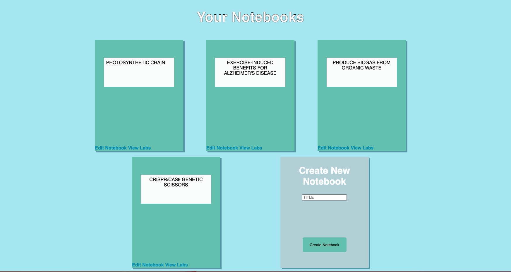
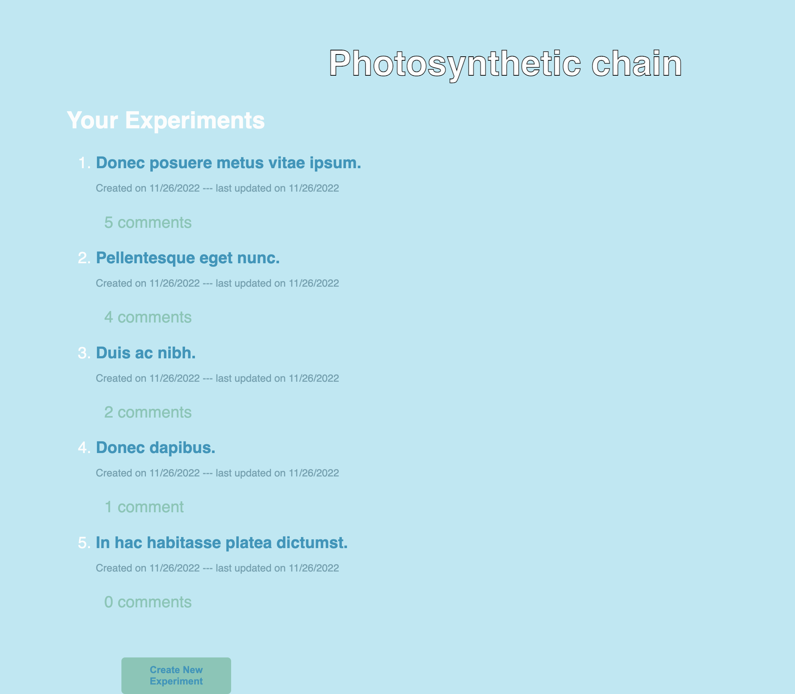

# Work Bench 

## Description 
This application is a virtual lab bench where the user can create new notebooks for different subjects, add new lab entries to the notebooks, delete lab entries, and comment on other users lab entries.

## Badges
 

 
 
 
 
 
 
 

## Table of Contents 
[Visuals](#visuals) 
[Installation](#installation) 
[Usage](#usage) 
[Support](#support) 
[Roadmap](#roadmap) 
[Acknowledgements](#acknowledgements) 
[License](#license) 
[Status](#project-status)

## Visuals

## Installation 
In order for this application to work, the user will need to install the <a href="https://expressjs.com/en/starter/installing.html">Express</a>, <a href="https://www.npmjs.com/package/express-handlebars">Express Handlebars</a>, <a href="https://www.npmjs.com/package/express-session">Express session</a>, <a href="https://www.npmjs.com/package/mysql2">MySQL2</a>, <a href="https://www.npmjs.com/package/sequelize">Sequelize</a>, and <a href="https://www.npmjs.com/package/connect-session-sequelize">connect-session-sequelize</a> packages. The user will also need to install <a href="https://www.npmjs.com/package/dotenv">dotenv</a> and <a href="https://www.npmjs.com/package/bcrypt">bcrypt</a> to hide sensitve information like the database password.

## Usage

First, the user will open the terminal and navigate to the application.  
Then, the user will run mysql2 using either the command: 

 > % mysql -u root

or

> % mysql -u root -p 

if there is no set password or a set password, respectively. This will create the database.  
Once it is confirmed that the database is created and in use, the user can exit mysql using the command: 

 > % quit

The user can then interact with the application by typing 

 > npm start 

into the terminal and navigating to the browser and typing the following into the search bar:

 > localhost:3001

There, the user will see the homepage. 

On the homepage, the user will select the sign-in link. There, the user can sign-in if they have already created an account or can click the link to sign-up if they have not. 

After signing-in or signing-up, the user will be taken to their dashboard. An existing user will see their previous lab notebooks with the options to view the experiments contained within, edit the notebook, or create a new notebook. 

If they are a new user, they will see an empty dashboard with the option to create their first notebook. 

The user also has the option to view and edit the experiments contained within each notbook, as well as view and post comments to an experiment. 

 

## Support

## Roadmap
Future iterations of this application will include the ability to add a manager and will allow only users with proper authorization to access lab entries. 

## Acknowledgements 
This project was made by <a href="https://github.com/TBertazoli">Tatiana Bertazoli</a>, <a href="https://github.com/emsaw721">Emily Hill</a>, and <a href="https://github.com/deadseal001">Wenbo Li</a>. 

The badges for this README were acquired <a href="https://dev.to/envoy_/150-badges-for-github-pnk">here</a> and <a href="https://shields.io/">here</a>.

## License 

## Project Status 
